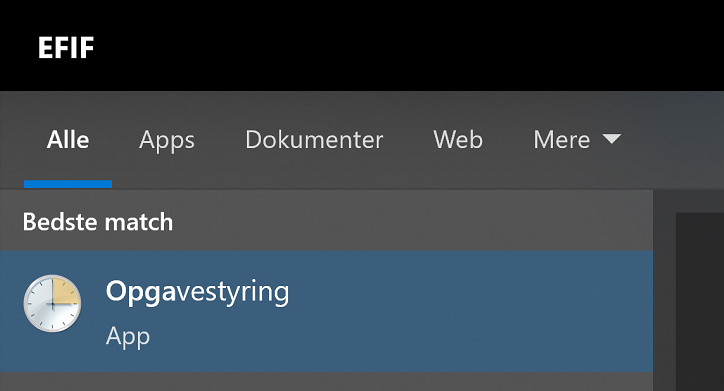
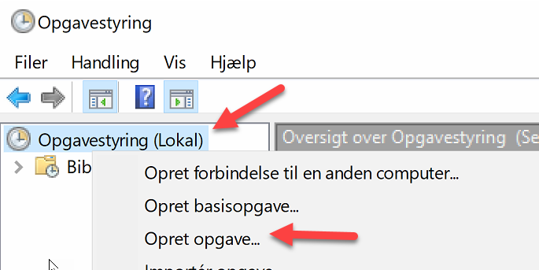
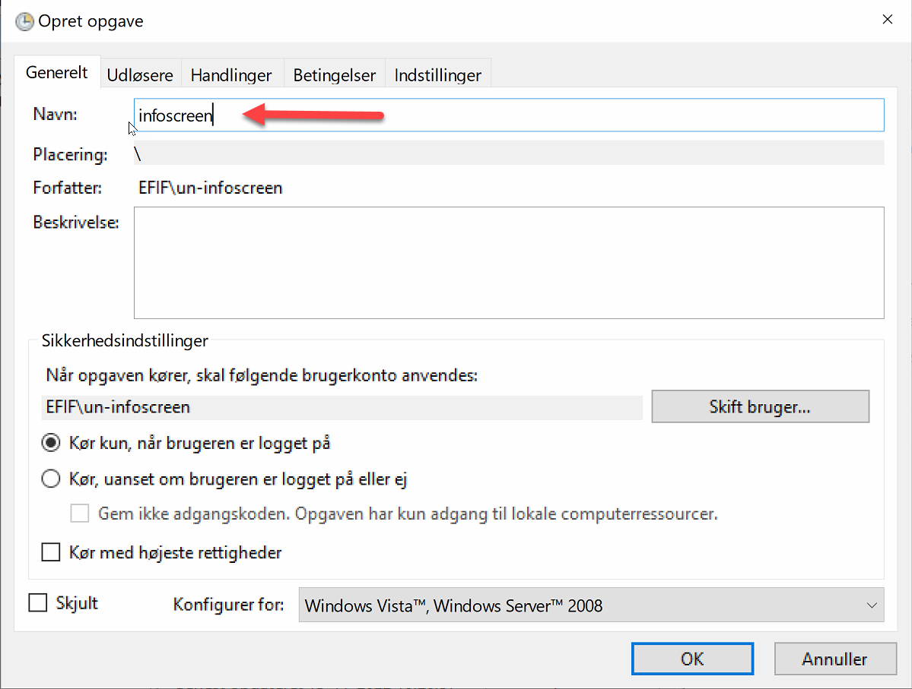
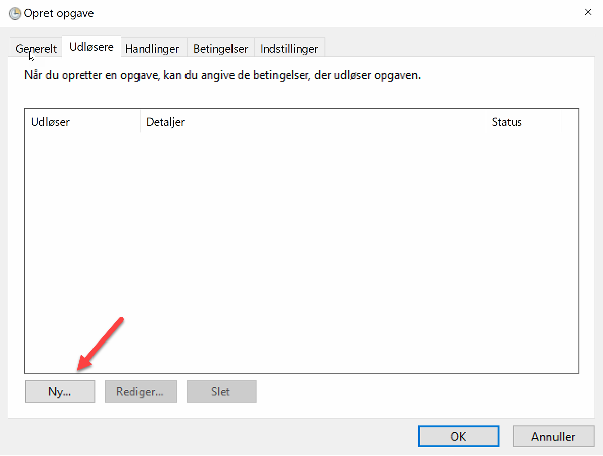
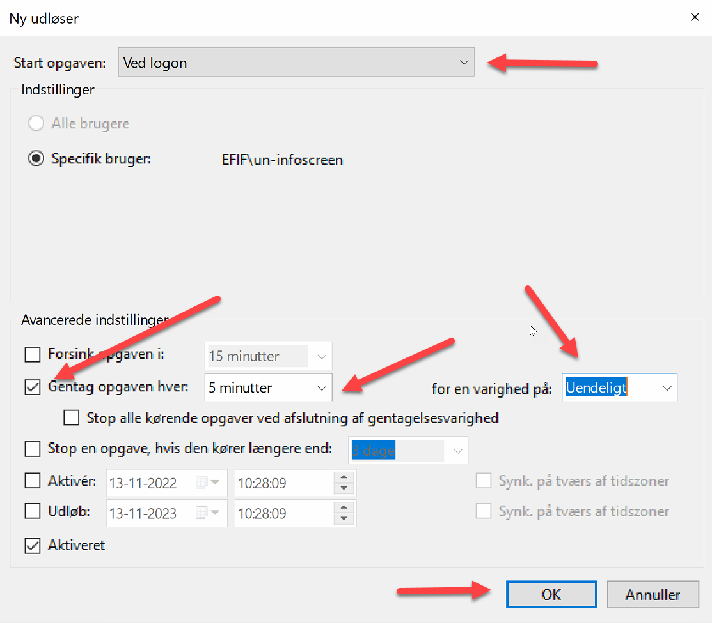
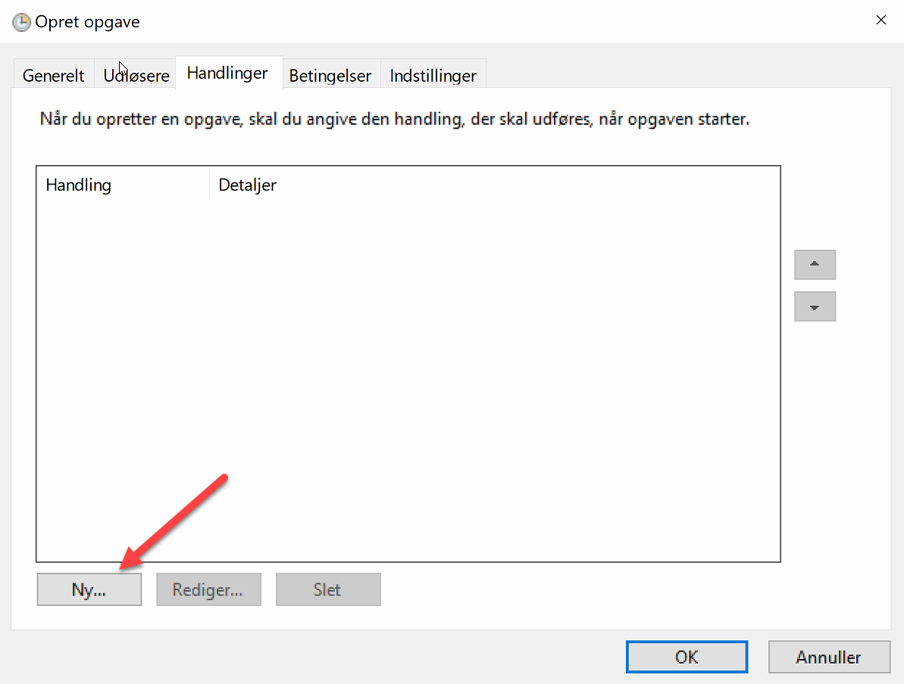
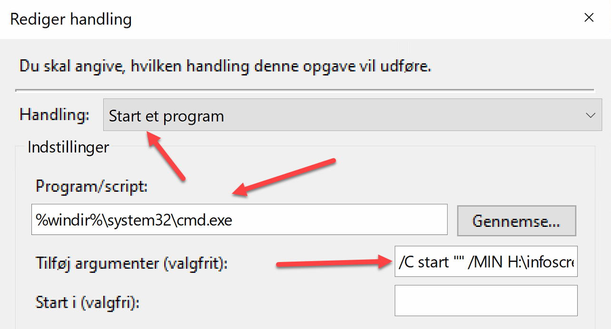
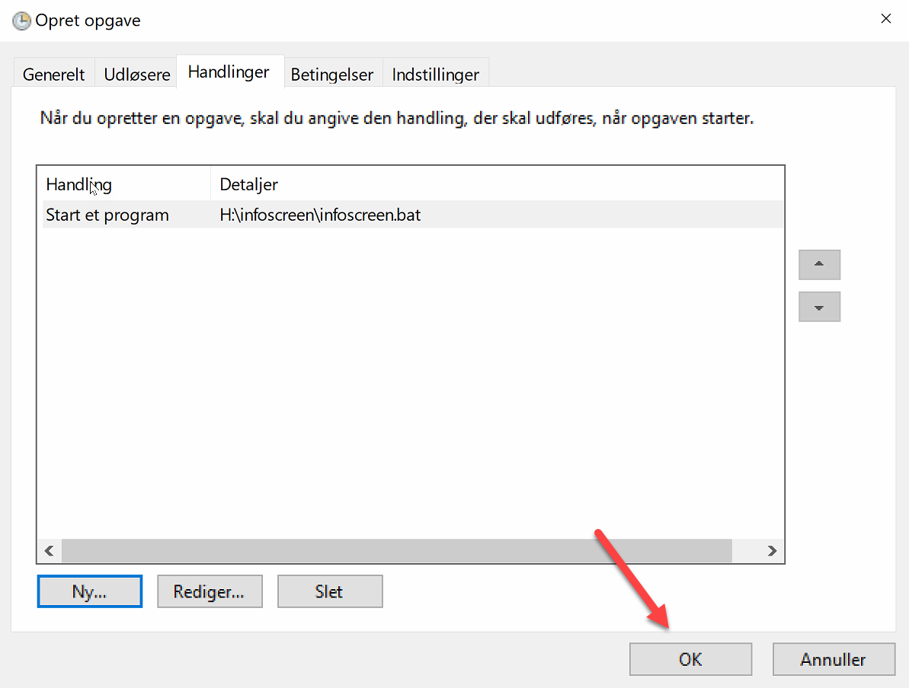

# Infoscreen v2 for U/NORD

## Installation on a client infoscreen computer

1. Install a computer from SCCM with standard install image.
2. Install Windows updates and updates from computer vendor
3. Log in as user `un-infoscreen` 
4. Copy H:\SetAutologin-infoscreenuser.reg to desktop and run it as administrator
5. in Windows Control Panel, power options, change `hypernation` to never and `turn off display` to never
6. Install the following software:
   1. Chrome from SCCM
   2. Teamviewer host (https://get.teamviewer.com/wzwznkx) 
   3. From H:\ install python-3.11.0-amd64.exe
7. Check that the computer client exist in `H:\infoscreen\src\infoscreen.json`. Add it if missing.
8. Setup Task Scheduler
   1. Start Task Scheduler
   
   2. Create a new task
   
   3. Give it a name
   
   4. Create a trigger
   
   5. Set trigger to `At Log On`
   
   6. Create an action
   
   7. Set action to `Start a program` and 
   **Program/script**
9. ```
   %windir%\system32\cmd.exe
   ```
   
   **Add-arguments**
   ```
   /C start "" /MIN H:\infoscreen\infoscreen.bat
   ```
   
   8. Click `OK` to save the task
   
9. Reboot the computer and your infoscreen should be up and running